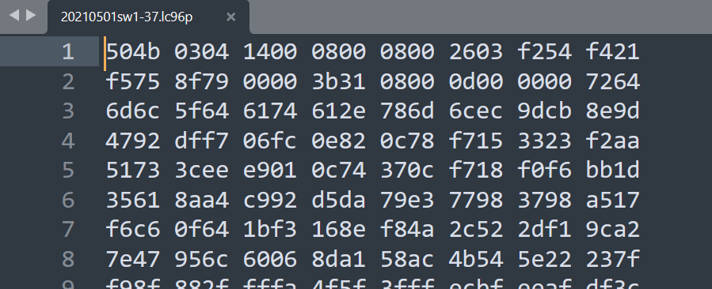
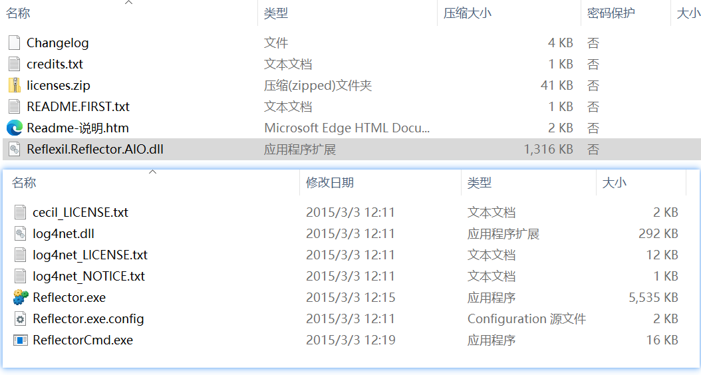
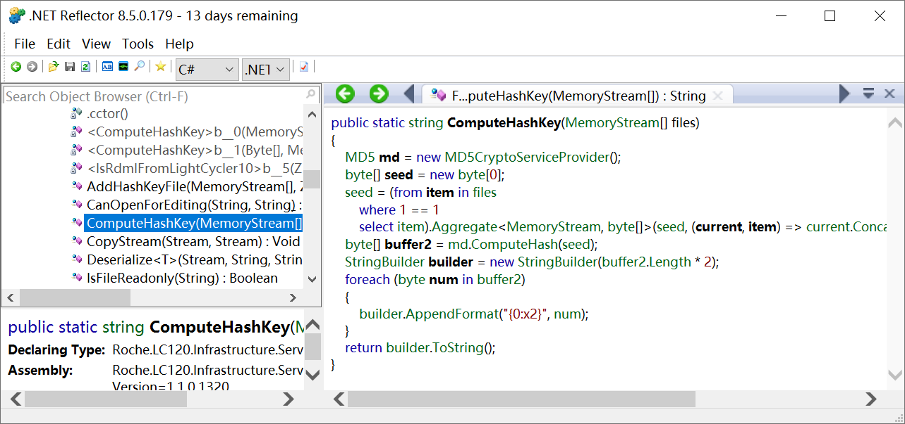

## 目录

*   [零、需求](#零需求)

*   [壹、探索](#壹探索)

*   [贰、开发](#贰开发)

*   [叁、总结](#叁总结)

*   [肆、参考](#肆参考)

# 修改LightCycler® 96文件Summary日期

## 零、需求

来自我的一个朋友


她是要准备改某个软件（LightCycler® 96）保存的数据（时间和日期），当时得知此意图后心里已经判了8成不能改了，除非这个软件提供这个功能，因为这些奇奇怪怪的软件保存的数据都是它的专有格式，很少有方法可以改。

当时也没啥事做，她要我帮她找找看有没有方法，于是就叫她发点样品过来。


然后她把软件和一个数据样本一起发了过来，发软件是我没想到的QWQ。


不过还好，没多大的一个软件。

然后就开始分析看看怎么处理。

## 壹、探索

因为软件发过来了，一开始是在软件里研究看看能不能改，然后再建点儿文件，好等下对比来看，结果发现软件里确实没有提供接口，改不了。

然后针对刚刚的.lc96p文件，用记事本打开，发现是二进制的，不能直接改。



不过这个文件头有点儿熟悉，去问度娘发现一个好消息！


于是直接用7z解压出来，得到如下文件：


好家伙，顿时有希望了！

于是查看各个文件的内容，发现要改的时间和日期就直接明文写在其中：


包括实验数据也在，很好！

然后我尝试修改，保存，再压缩成zip，改回原来的后缀，尝试用软件打开，发现不太行，这个软件有哈希校验！


这就比较难搞了，不过下面给出了日志，可以先看看日志说了啥：

```纯文本
Date:170?Thread:70?Level:62?Logger:300?Message[EOL]
[2022-08-09 22:17:20,967][INFO][Logger:Roche.LC120.Infrastructure.Shell.LC120ShellApplication][Thread:1][Source:LC120ShellApplication.RunInReleaseMode:0] Running application in release mode. [EOL]
[2022-08-09 22:17:21,674][INFO][Logger:Roche.LC120.Infrastructure.Shell.LC120ShellApplication][Thread:1][Source:LC120ShellApplication.<BeforeShellCreated>b__0:0] Module Roche.LC120.Infrastructure.Services loaded. [EOL]
[2022-08-09 22:17:21,676][INFO][Logger:Roche.LC120.Infrastructure.Shell.LC120ShellApplication][Thread:1][Source:LC120ShellApplication.<BeforeShellCreated>b__0:0] Module Roche.LC120.RunEditor loaded. [EOL]
[2022-08-09 22:17:21,677][INFO][Logger:Roche.LC120.Infrastructure.Shell.LC120ShellApplication][Thread:1][Source:LC120ShellApplication.<BeforeShellCreated>b__0:0] Module Roche.LC120.SampleEditor loaded. [EOL]
[2022-08-09 22:17:21,677][INFO][Logger:Roche.LC120.Infrastructure.Shell.LC120ShellApplication][Thread:1][Source:LC120ShellApplication.<BeforeShellCreated>b__0:0] Module Roche.LC120.RawData loaded. [EOL]
[2022-08-09 22:17:21,678][INFO][Logger:Roche.LC120.Infrastructure.Shell.LC120ShellApplication][Thread:1][Source:LC120ShellApplication.<BeforeShellCreated>b__0:0] Module Roche.LC120.Analysis loaded. [EOL]
[2022-08-09 22:17:21,678][INFO][Logger:Roche.LC120.Infrastructure.Shell.LC120ShellApplication][Thread:1][Source:LC120ShellApplication.<BeforeShellCreated>b__0:0] Module Roche.LC120.InstrumentManagerModule loaded. [EOL]
[2022-08-09 22:17:21,678][INFO][Logger:Roche.LC120.Infrastructure.Shell.LC120ShellApplication][Thread:1][Source:LC120ShellApplication.<BeforeShellCreated>b__0:0] Module Roche.LC120.Reports loaded. [EOL]
[2022-08-09 22:17:21,678][INFO][Logger:Roche.LC120.Infrastructure.Shell.LC120ShellApplication][Thread:1][Source:LC120ShellApplication.<BeforeShellCreated>b__0:0] Module Roche.LC120.Analysis.QualDetection loaded. [EOL]
[2022-08-09 22:17:21,678][INFO][Logger:Roche.LC120.Infrastructure.Shell.LC120ShellApplication][Thread:1][Source:LC120ShellApplication.<BeforeShellCreated>b__0:0] Module Roche.LC120.Analysis.Hrm loaded. [EOL]
[2022-08-09 22:17:21,678][INFO][Logger:Roche.LC120.Infrastructure.Shell.LC120ShellApplication][Thread:1][Source:LC120ShellApplication.<BeforeShellCreated>b__0:0] Module Roche.LC120.Analysis.RelQuant loaded. [EOL]
[2022-08-09 22:17:21,678][INFO][Logger:Roche.LC120.Infrastructure.Shell.LC120ShellApplication][Thread:1][Source:LC120ShellApplication.<BeforeShellCreated>b__0:0] Module Roche.LC120.Analysis.EndpointGenotyping loaded. [EOL]
[2022-08-09 22:17:21,678][INFO][Logger:Roche.LC120.Infrastructure.Shell.LC120ShellApplication][Thread:1][Source:LC120ShellApplication.<BeforeShellCreated>b__0:0] Module Roche.LC120.Analysis.TmCalling loaded. [EOL]
[2022-08-09 22:17:21,678][INFO][Logger:Roche.LC120.Infrastructure.Shell.LC120ShellApplication][Thread:1][Source:LC120ShellApplication.<BeforeShellCreated>b__0:0] Module Roche.LC120.Analysis.AbsQuant loaded. [EOL]
[2022-08-09 22:17:21,678][INFO][Logger:Roche.LC120.Infrastructure.Shell.LC120ShellApplication][Thread:1][Source:LC120ShellApplication.<BeforeShellCreated>b__0:0] Module Roche.LC120.Analysis.BatchExporter loaded. [EOL]
[2022-08-09 22:17:21,678][INFO][Logger:Roche.LC120.Infrastructure.Shell.LC120ShellApplication][Thread:1][Source:LC120ShellApplication.<BeforeShellCreated>b__0:0] Module Roche.LC120.ExperimentEditor loaded. [EOL]
[2022-08-09 22:17:21,835][INFO][Logger:Roche.LC120.Infrastructure.Shell.LC120ShellForm][Thread:1][Source:LC120ShellForm.OnLoad:0] Application shell form loaded. [EOL]
[2022-08-09 22:17:24,233][DEBUG][Logger:Roche.LC120.Infrastructure.Shell.LC120ShellForm][Thread:1][Source:LC120ShellForm.OpenItemClick:0] Initiating experiment file opening. [EOL]
[2022-08-09 22:17:28,888][INFO][Logger:Roche.LC120.Infrastructure.Shell.LC120ShellForm][Thread:1][Source:LC120ShellForm.OpenItemClick:0] Opening file "D:\Minuy\Desktop\20210501sw1-37\20210501sw1-37.zip.lc96p". [EOL]
[2022-08-09 22:17:28,924][DEBUG][Logger:Roche.LC120.Infrastructure.Services.FileHandlerHelper][Thread:1][Source:FileHandlerHelper.ValidateHashKey:0] Validating hash-key... [EOL]
[2022-08-09 22:17:28,953][DEBUG][Logger:Roche.LC120.Infrastructure.Services.FileHandlerHelper][Thread:1][Source:FileHandlerHelper.ValidateHashKey:0] Hash-key validation result: False. [EOL]
[2022-08-09 22:17:28,953][ERROR][Logger:Roche.LC120.Infrastructure.Services.Lc96FileHandlerService][Thread:1][Source:Lc96FileHandlerService.LoadFile:0] Lc96 file "D:\Minuy\Desktop\20210501sw1-37\20210501sw1-37.zip.lc96p" hash key validation error. [EOL]
[2022-08-09 22:17:28,953][ERROR][Logger:Roche.LC120.Infrastructure.Shell.LC120ShellFormPresenter][Thread:1][Source:LC120ShellFormPresenter.HandleFileLoadingException:0] Error while loading file "D:\Minuy\Desktop\20210501sw1-37\20210501sw1-37.zip.lc96p". Roche.LC120.Infrastructure.Interface.Exceptions.InvalidHashKeyException: Lc96 file "D:\Minuy\Desktop\20210501sw1-37\20210501sw1-37.zip.lc96p" hash key validation error.
   at Roche.LC120.Infrastructure.Services.Lc96FileHandlerService.LoadFile(String filePath, IRdmlMappingResolver mappingResolver, FileAccess fileAccess, Boolean definitionOnly)
   at Roche.LC120.Infrastructure.Services.Lc96FileHandlerService.LoadFile(String filePath, IRdmlMappingResolver mappingResolver, Boolean loadAsReadOnly)
   at Roche.LC120.Infrastructure.Services.FileHandlerService.LoadFile(String filePath, IRdmlMappingResolver rdmlMappingResolver, Boolean loadAsReadOnly)
   at Roche.LC120.Infrastructure.Shell.LC120ShellFormPresenter.LoadDomainModel(String filePath)
[EOL]

```

日志告诉我们，验证失败是在`Roche.LC120.Infrastructure.Services.FileHandlerHelper`这个组件中发生的，然后去浅浅地看一下软件目录，发现了这个dll文件：


这东西也不大，我记得之前有修改dll的方法的，既然是校验，那直接一直返回true就好了，开干，还是去问度娘，度娘给了我这个东西：

[https://blog.csdn.net/weixin\_39237340/article/details/120150364](https://blog.csdn.net/weixin_39237340/article/details/120150364 "https://blog.csdn.net/weixin_39237340/article/details/120150364")

（反编译DLL并修改后再生成DLL）

按照这篇文章的方式，真的在相关目录下找到了这个组件，并且成功反编译出来了.il文件


这个工具应该是随着VisualStudio2019安装的，日期对得上。


反编译出来的il文件，内容好多，但是可以搜得到这个字符串常量，还有看着像是某种规范的编程语言，有点像汇编！

再去问度娘，得到了这个东西：

IL指令表

[https://www.cnblogs.com/uftwkb24/p/9669801.html](https://www.cnblogs.com/uftwkb24/p/9669801.html "https://www.cnblogs.com/uftwkb24/p/9669801.html")

嗯，现在能看懂一些这些il代码了！

然后接着分析，发现名为ValidateHashKey的函数有两个重载，都是返回bool型

```docker
  .method public hidebysig static bool  ValidateHashKey(class [mscorlib]System.IO.MemoryStream[] files,
                                                        class [mscorlib]System.IO.MemoryStream hashKeyStream) cil managed
  {
```

```docker
  .method public hidebysig static bool  ValidateHashKey(class [mscorlib]System.IO.MemoryStream[] files,
                                                        string hashKey) cil managed
  {
```

一个是对比两个流的哈希，还有一个是给出一个流和一个现有的哈希做对比。

简单看了下返回值，调用方式有点儿特别，我没怎么接触过汇编，比如它要调个方法传两个参数，得先用


那这样不是把两个计算堆栈上的值改成一样的就好了，返回的就永远是true了！！


简单看了下其他部分的代码，喵\~

好，改好了怎么编译呢？还是度娘给的第一篇文章，在这里，不过不能直接打开，得用cmd操作。


CMD操作如下，成功生成了新的dll文件，并替换了老文件\~

```纯文本
Microsoft Windows [版本 10.0.19044.1865]
(c) Microsoft Corporation。保留所有权利。

C:\WINDOWS\system32>cd D:
D:\

C:\WINDOWS\system32>D:

D:\>cd D:\Minuy\Desktop\91\Bin\Bin

D:\Minuy\Desktop\91\Bin\Bin>C:\Windows\Microsoft.NET\Framework\v4.0.30319\ilasm.exe /dll/resourece=Roche.LC120.Infrastructure.Services.res Roche.LC120.Infrastructure.Services.il

Microsoft (R) .NET Framework IL Assembler.  Version 4.8.4084.0
Copyright (c) Microsoft Corporation.  All rights reserved.
Assembling 'Roche.LC120.Infrastructure.Services.il'  to DLL --> 'Roche.LC120.Infrastructure.Services.dll'
Source file is UTF-8

Assembled method Roche.LC120.Infrastructure.Services.CalculationPackageService?<>c__DisplayClass12?<>c__DisplayClass16::.ctor
Assembled method Roche.LC120.Infrastructure.Services.CalculationPackageService?<>c__DisplayClass12?<>c__DisplayClass16::<Calculate>b__b
.
...... 省略

Class 251
Class 252       Props: 3;
Class 253       Props: 6;
Class 254       Props: 2;
Class 255
Class 256
Class 257       Props: 1;
Class 258       Props: 2;
Class 259       Props: 3;
Class 260       Props: 5;
Class 261       Props: 2;
Class 262
Class 263       Props: 2;
Class 264       Props: 6;
Class 265
Class 266       Props: 2;
Class 267
Class 268       Props: 2;
Resolving local member refs: 0 -> 0 defs, 0 refs, 0 unresolved
Writing PE file
Operation completed successfully

D:\Minuy\Desktop\91\Bin\Bin>

```


然后再次运行软件，尝试打开，没问题，时间和日期也改过来了\~


但是如果不破解那个哈希校验的话，正常软件打不开，想着另存为会不会重新生成哈希校验值，于是我另存为一个文件，然后发给她，可以用\~\~\~


原本以为就这样就结束了，找到破解方法了，整理一下就好了，没想到她有2000多个要改！！！

这手工咋改得完！

基本原理知道了，差个哈希值算法，差个程序。

刚刚的il文件看着实在费劲，再去问度娘，它给了我一些这些东西：



Reflector和一个它的插件Reflexil.Reflector.AIO

刚刚分析`Roche.LC120.Infrastructure.Services.il`的时候有看到命名为ComputeHashKey的方法，现在去浅浅分析一下\~

得到了这几个方法：

计算哈希值的：



如何解包的：


如何打包的：


好，很好，有了这些算法，就可以自己写个代码进行批量打包了，别说是两千个，两亿个都不怕\~

## 贰、开发

开发过程就不详细讲了，就是基本的Winform开发，就是遇到个新问题，我的电脑是显示的150%缩放比的，对Winform的窗口布局器不太好，有点儿乱。


经过一天的开发，基本功能算是完成了， 左边是添加文件的地方，可以拖放，也可以选择。右边上面是调整时间的地方，调整到你需要修改的时间，不能每个时间都精确，只能总体偏移，上次乱调时间遇到了个堆栈溢出打不开的情况。右边中间是保存的位置，可以选择也可以直接输入。右边下面是操作栏，其中的取消验证就是替换一下我反汇编之后的那个dll，修改是直接执行修改，现在能实现批量修改了。下面的版本号点击进去是一个日志和关于界面，软件出现的问题基本上可以从这里查到。点击修改之后会弹出个面板，里面详细记录了修改的过程。


处理进度


软件日志

软件开发就是除了基本的实现自己搞，核心的解包、打包、校验都是复制粘贴反编译出来的代码的，还挺愉快的。

软件开发挺快乐的，也挺累的。

## 叁、总结

根据来的线索，终于理解了为啥日志要分级了，之前学SpringBoot的时候感觉这类你看就看呗，现在突然意识到，能隐藏的就要隐藏！

还有看到的il的代码，感觉这个更贴近于计算机的实际运行，人看着挺难懂的，不过我觉得方便机器执行，作为学计算机专业相关的同学，还是有必要了解，认识一下。

搞这个东西花了一天，挺愉快的，但是也落下了一天正常的计划，还挺兴奋的，估计会影响到明天，不过真的是快乐，也算是第一次比较系统的破解这个东西吧。

在反编译的时候看到了很多别人写的代码，很多东西都值得我去学习，我原本就不是学软件的，想要在这方面有动作，还得把落下的补回来。

反编译的时候看到这个软件不仅仅只支持一种格式，可能还有3\~4种，有压缩的，有没压缩的，到时候再看看我朋友那边有啥需求吧，就先解决这一个格式再说。

## 肆、参考

[https://www.cnblogs.com/uftwkb24/p/9669801.html](https://www.cnblogs.com/uftwkb24/p/9669801.html "https://www.cnblogs.com/uftwkb24/p/9669801.html")

[https://blog.csdn.net/weixin\_39237340/article/details/120150364](https://blog.csdn.net/weixin_39237340/article/details/120150364 "https://blog.csdn.net/weixin_39237340/article/details/120150364")

[http://t.zoukankan.com/lfxiao-p-6728226.html](http://t.zoukankan.com/lfxiao-p-6728226.html "http://t.zoukankan.com/lfxiao-p-6728226.html")

[https://docs.microsoft.com/zh-cn/visualstudio/designers/disable-dpi-awareness?view=vs-2022](https://docs.microsoft.com/zh-cn/visualstudio/designers/disable-dpi-awareness?view=vs-2022 "https://docs.microsoft.com/zh-cn/visualstudio/designers/disable-dpi-awareness?view=vs-2022")

[http://www.manongjc.com/detail/50-ekzxgoslfbelqiv.html](http://www.manongjc.com/detail/50-ekzxgoslfbelqiv.html "http://www.manongjc.com/detail/50-ekzxgoslfbelqiv.html")

[https://www.nuget.org/packages/Ionic.Zip](https://www.nuget.org/packages/Ionic.Zip "https://www.nuget.org/packages/Ionic.Zip")

[https://qa.1r1g.com/sf/ask/431301741/](https://qa.1r1g.com/sf/ask/431301741/ "https://qa.1r1g.com/sf/ask/431301741/")
